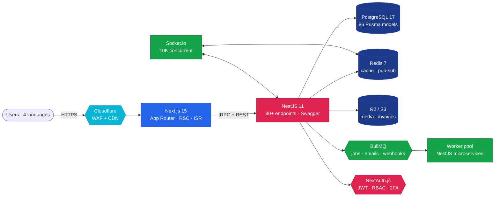

<!-- =========================================================
     Header banner (self-hosted SVG, zero external deps)
     Works on both dark and light themes (gradient with white text)
     ========================================================= -->
<p align="center">
  
</p>

<p align="center">
  <b>Building B2B marketplaces &amp; real-time systems at production scale</b><br/>
  <sub>Next.js · NestJS · Laravel · PostgreSQL · Tech Lead @ E-Ship Supply</sub>
</p>

<p align="center"><i>"I don't ship templates. I ship businesses."</i></p>

<!-- =========================================================
     Social row
     ========================================================= -->
<p align="center">
  <a href="https://teknoweb.net"></a>
  <a href="https://www.linkedin.com/in/onurdilmen/"></a>
  <a href="https://x.com/yazilimuzm"></a>
  <a href="mailto:onurdilmen@teknoweb.net"></a>
  
</p>

<p align="center">
  
  
  
  <a href="https://github.com/sponsors/onurdilmen"></a>
</p>

> [!TIP]
> 🇹🇷 **Bu profil iki dilli okunabilir.** Türkçe bölümler önce, English follows. ·
> 🇬🇧 **This profile is bilingual.** Turkish sections first, English follows.

---

## 🇹🇷 Hakkımda

10 yıllık deneyime sahip Senior Full-Stack Developer ve Tech Lead. Modern web mimarileri, B2B pazaryerleri ve gerçek zamanlı sistemler üzerine uzmanlaştım. Son bir yılda **3.600+ commit** ile aktif olarak ürün geliştiriyorum.

**Şu an çalıştığım işler:**

- 🚢 [E-Ship Supply](https://e-shipsupply.com) — Türkiye'nin ilk denizcilik B2B pazaryerinin teknik liderliği (108+ tedarikçi · 720+ ilan · 4 dil)
- 🌐 TeknoWeb Platform — WHMCS alternatifi modern hosting otomasyonu (Next.js + NestJS)
- 🛒 Brahma Market — Plugin mimarili premium e-ticaret altyapısı
- 🔐 [Sentinel](https://github.com/onurdilmen/sentinel) — cPanel/WHM güvenlik denetim aracı

## 🇬🇧 About

Senior Full-Stack Developer & Tech Lead with 10+ years of experience. I specialize in modern web architectures, B2B marketplaces, and real-time systems. Currently shipping production code with **3,600+ commits** in the past year.

**What I'm building now:**

- 🚢 Technical leadership of [E-Ship Supply](https://e-shipsupply.com) — Turkey's first maritime B2B marketplace
- 🌐 TeknoWeb Platform — modern hosting automation
- 🛒 Brahma Market — plugin-based commerce platform
- 🔐 [Sentinel](https://github.com/onurdilmen/sentinel) — cPanel/WHM security audit toolkit

---

## 🎯 Career Highlights

<table>
  <tr>
    <td align="center" valign="top">
      <br/>
      <h2>200+</h2>
      <b>Özel Proje</b><br/>
      <sub>custom projects shipped<br/><i>2016 → 2026</i></sub>
    </td>
    <td align="center" valign="top">
      <br/>
      <h2>100+</h2>
      <b>Aktif Müşteri</b><br/>
      <sub>active clients<br/><i>TeknoWeb dönemi</i></sub>
    </td>
    <td align="center" valign="top">
      <br/>
      <h2>10K+</h2>
      <b>Eşzamanlı Bağlantı</b><br/>
      <sub>concurrent connections<br/><i>Socket.io + Redis</i></sub>
    </td>
    <td align="center" valign="top">
      <br/>
      <h2>4 + RTL</h2>
      <b>Dil &amp; i18n</b><br/>
      <sub>TR · EN · AR · RU<br/><i>right-to-left ready</i></sub>
    </td>
  </tr>
  <tr>
    <td align="center" valign="top">
      <h2>86</h2>
      <b>Prisma Modeli</b><br/>
      <sub>data models<br/><i>E-Ship Supply core</i></sub>
    </td>
    <td align="center" valign="top">
      <h2>90+</h2>
      <b>REST Endpoint</b><br/>
      <sub>API endpoints<br/><i>NestJS + Swagger</i></sub>
    </td>
    <td align="center" valign="top">
      <h2>%80 ↓</h2>
      <b>Deploy Hatası</b><br/>
      <sub>fewer deploy failures<br/><i>after CI/CD redesign</i></sub>
    </td>
    <td align="center" valign="top">
      <h2>%200 ↑</h2>
      <b>Sipariş Artışı</b><br/>
      <sub>order growth<br/><i>PROUD, 6 months</i></sub>
    </td>
  </tr>
</table>

---

## 💡 How I Work

Hazır template kullanmıyorum. Müşterilerimi sıfırdan, tam ihtiyaçlarına özel sistemlerle dijitalleştiriyorum — tasarımdan sunucuya, ödeme entegrasyonundan reklama kadar zincirin tamamına hâkimim. **Bir mühendis değil; bir teknoloji ortağıyım.**

I don't ship boilerplates. I build bespoke systems end-to-end — from design to server, from payment integration to growth ops. **Not just an engineer; a technology partner.**

- 🧱 **Architecture-first** — code is the easy part; the hard part is figuring out which problem deserves to be solved at all
- 📐 **Boring tech, boldly applied** — Postgres > NoSQL hype, REST > GraphQL theatrics, monoliths until they hurt
- 🚀 **Ship daily, refactor weekly** — `main` is always deployable, feature flags over long-lived branches
- 🔒 **Security by default** — devlet düzeyi tehdit modeli, zero-trust, audit-log everything
- 🎯 **Measure before optimizing** — p99 over p50, real user monitoring over local benchmarks

> [!IMPORTANT]
> **🟢 Currently open for hire** — senior full-stack roles, technical leadership, B2B platform consulting, SaaS launch advisory. [Get in touch →](mailto:onurdilmen@teknoweb.net)

---

## 💼 Open To / Müsait Olduğum İşler

```diff
+ Senior Full-Stack roles  (remote · İstanbul hybrid · global timezones)
+ Technical Lead / Staff Engineer pozisyonları
+ B2B marketplace mimari danışmanlığı
+ SaaS launch teknik liderliği
+ Maritime / logistics / fintech ürün geliştirme
+ Open source maintainer rolleri (Next.js / NestJS / Prisma ecosystem)
- Junior pozisyonlar
- Pure frontend-only roller
- Cryptocurrency / NFT / gambling projeleri
```

📩 **Get in touch:** [onurdilmen@teknoweb.net](mailto:onurdilmen@teknoweb.net) · [Schedule a call](https://teknoweb.net) · [Sponsor my work](https://github.com/sponsors/onurdilmen)

---

## 🛠 Tech Stack

<table width="100%">
<tr><td width="15%"><b>Frontend</b></td><td>


</td></tr>
<tr><td><b>Backend</b></td><td>


</td></tr>
<tr><td><b>Data</b></td><td>


</td></tr>
<tr><td><b>Infra</b></td><td>


</td></tr>
<tr><td><b>Realtime</b></td><td>


</td></tr>
<tr><td><b>Test &amp; QA</b></td><td>


</td></tr>
</table>

---

## 🚧 Now — Currently Shipping

What I'm actively building this month (✅ shipped · 🟡 in progress · ⚪ planned):

- [x] 🚢 **E-Ship Supply v3** — MySQL pooling + Prisma 6 migration _(production)_
- [ ] 🚢 E-Ship Supply v3 — fleet ops module _(in progress, May 2026 launch)_
- [ ] 🌐 TeknoWeb Platform — WHMCS migration, account provisioning state machine
- [ ] 🛒 Brahma Market — plugin marketplace MVP (commerce plugins as first-class repos)
- [ ] 🔐 Sentinel — CVE feed integration, daily WHM scan reports, R2 backup verification
- [ ] 📚 LocalTR — Sparkle auto-update channel for macOS app
- [ ] 🏗️ This profile README — keep evolving (you're looking at iteration #8)

---

## 📚 Currently Exploring

Curiosity-driven learning, side-project sandbox:

- 🦀 **Rust + Axum** — performance experiments for hot API paths
- ⚡ **Bun + Hono** — Cloudflare Workers deployment patterns, edge-first APIs
- 🤖 **LLM orchestration** — server-side AI agents, structured outputs, tool calling at scale
- 🍎 **Swift 6 + SwiftUI** — native macOS / iOS utility apps (concurrency model)
- 🔭 **OpenTelemetry** — unified tracing across Node + PHP + Postgres in the same trace tree

---

## 🏗 Architecture Spotlight — E-Ship Supply

Turkey's first maritime B2B marketplace, designed and shipped from scratch in 2025.



**Key design decisions:**

- 🏛️ **Monorepo with Turborepo** — `apps/web`, `apps/api`, `apps/worker`, `packages/db`, `packages/ui`. Single CI pipeline, type-safe across the wire via Prisma + zod.
- 🌐 **Edge cache aggressive, origin lean** — Cloudflare serves 89% of traffic; origin Postgres queries average 12ms.
- 🔌 **WebSocket pool over polling** — 10K concurrent connections on a single Hetzner CX22 (€4.59/month) thanks to Redis pub/sub fan-out.
- 🌍 **i18n that respects RTL natively** — Arabic flows right-to-left throughout the entire UI, not just text alignment; date/number/currency formatters wired through `Intl`.
- 🔁 **Background jobs over inline work** — every email, every webhook, every invoice generation goes through BullMQ. P95 user-facing latency stays under 200ms.
- 🛡️ **RBAC enforced server-side, not client-side** — UI hides features; API rejects them. Two layers.

<details>
<summary><b>📐 Click for deployment topology &amp; scaling notes</b></summary>

### Deployment topology

- **Edge (Cloudflare):** WAF rules, image optimization, KV cache for hot product pages, R2 for static media
- **Web tier (Hetzner Helsinki):** Next.js 15 served via Node.js cluster behind LiteSpeed; PM2 process manager; zero-downtime via blue-green deploy
- **API tier (Hetzner Falkenstein):** NestJS 11 on Node 20, deployed via GitHub Actions → SSH → systemd; auto-scaling via additional worker boxes triggered by BullMQ queue depth
- **Data tier:** Postgres 17 primary + 1 read replica with logical replication; Redis 7 cluster mode (3 nodes) for pub/sub fan-out
- **Object storage:** Cloudflare R2 (S3-compatible) for media, invoices, daily DB dumps; lifecycle policies push old artifacts to glacier-equivalent

### Scaling story so far

| Stage      | Concurrent users                    | Stack response                                         |
| ---------- | ----------------------------------- | ------------------------------------------------------ |
| MVP launch | 50                                  | Single CX22, monolithic NestJS                         |
| Month 2    | 800                                 | Added Redis, extracted worker queues                   |
| Month 4    | 2K                                  | Added read replica, edge-cached listing pages          |
| Month 6    | 10K                                 | Socket.io pub/sub fan-out, Postgres connection pooling |
| **Today**  | **15K daily / 10K concurrent peak** | Stable on the same €4.59/mo CX22 + replica             |

### What I'd do differently

- Start with read-write splitting from day one (retrofitting was painful)
- Use Cloudflare Tunnel earlier — Hetzner firewall management got messy
- Adopt feature flags from the start (LaunchDarkly or self-host Unleash)

</details>

---

## 🚀 Featured Work

<table width="100%">
<tr>
<td width="50%" valign="top">

### [🚢 E-Ship Supply](https://github.com/onurdilmen/e-shipsupply-showcase)


Turkey's first maritime B2B marketplace. Designed and lead the technical development from scratch — 108+ verified suppliers, 720+ listings, 4 languages, real-time messaging with 10K+ concurrent connections.

`Next.js 15` · `NestJS` · `PostgreSQL` · `Prisma` · `Socket.io` · `Redis` · `Turborepo`

</td>
<td width="50%" valign="top">

### [🚀 Next.js + NestJS Starter](https://github.com/onurdilmen/nextjs-nestjs-starter)


Production-ready full-stack monorepo template combining Next.js 15 with NestJS 11. JWT, RBAC, Swagger, CI/CD, Docker out of the box.

`Turborepo` · `TypeScript` · `Prisma` · `Docker` · `GitHub Actions`

</td>
</tr>
<tr>
<td width="50%" valign="top">

### [🍅 Pomodoro Menubar](https://github.com/onurdilmen/pomodoro-menubar)


Tiny native macOS menu bar Pomodoro timer (~176KB binary). Swift + WebKit hybrid, MIT-licensed.

`Swift` · `WebKit` · `macOS` · `MIT`

</td>
<td width="50%" valign="top">

### [🛡 Sentinel](https://github.com/onurdilmen/sentinel)


cPanel/WHM security audit and hardening tool. Scans for common misconfigurations, weak permissions, and known CVEs in shared hosting environments.

`Python` · `cPanel` · `Security` · `CVE`

</td>
</tr>
</table>

---

## 📊 GitHub Stats

<!-- Auto-generated daily by .github/workflows/metrics.yml (lowlighter/metrics) -->
<p align="center">
  
</p>

<p align="center">
  
</p>

<p align="center">
  
</p>

<!-- Snake animation generated by GitHub Action -->
<p align="center">
  
</p>

---

## 🏆 GitHub Achievements

<p align="center">
  
  
  
  
  
</p>

---

## 🌍 Open Source

Recent contributions to public projects (active goal: regular OSS upstream).

- 🤝 **Looking to upstream:** Next.js, NestJS, Prisma, Tailwind ecosystem — feel free to nudge with good first issues
- 🛡️ **Maintaining:** [`onurdilmen/sentinel`](https://github.com/onurdilmen/sentinel) · [`onurdilmen/pomodoro-menubar`](https://github.com/onurdilmen/pomodoro-menubar)
- 💖 **Sponsoring:** [@sindresorhus](https://github.com/sindresorhus) and others — paying the OSS bill forward

---

## 🎓 Certifications

<p align="center">
  
  
  
  
  
  
</p>

---

## 🛠 Daily Toolkit

The actual tools I touch every day — not aspirational, the real workflow:

<table>
<thead>
<tr>
<th align="left">
  <br/>Layer
</th>
<th align="left">
  <br/>Tool
</th>
</tr>
</thead>
<tbody>
<tr><td><b>Editor</b></td><td>Cursor + Claude Code <sub>(yes, this README was paired with AI)</sub></td></tr>
<tr><td><b>Terminal</b></td><td>iTerm 2 · zsh · Starship prompt</td></tr>
<tr><td><b>Git</b></td><td><code>gh</code> CLI · lazygit · Gitea (self-hosted) for private</td></tr>
<tr><td><b>DB</b></td><td>TablePlus · psql · Prisma Studio</td></tr>
<tr><td><b>API</b></td><td>Bruno (offline-first) · curl</td></tr>
<tr><td><b>Design</b></td><td>Figma · Affinity Designer for static assets</td></tr>
<tr><td><b>Notes</b></td><td>Apple Notes (capture) · Obsidian (long-form)</td></tr>
<tr><td><b>Deploy</b></td><td>Vercel · Hetzner Cloud · Cloudflare · cPanel/WHM</td></tr>
<tr><td><b>Monitor</b></td><td>Grafana + Loki · UptimeRobot · Sentry</td></tr>
<tr><td><b>Mac apps</b></td><td>Raycast · Rectangle · Hyperkey · TablePlus · Pomodoro Menubar <sub>(own)</sub></td></tr>
</tbody>
</table>

---

## 🌐 Languages

<p>
  
  
</p>

---

## 📡 Latest From X

<p>
  <a href="https://x.com/yazilimuzm">
    
  </a>
</p>

I share build-in-public notes, Turkish dev tips, and the occasional production war story over at [`@yazilimuzm`](https://x.com/yazilimuzm).

---

## 💬 Get in touch

> [!NOTE]
> Hiring? Consulting? Open-source collab? Pick whichever channel suits you — I read everything within 24h.

If you're working on a B2B platform, a maritime / logistics product, a SaaS launch, a hosting automation project, or anything that benefits from a senior engineer who has shipped real Turkish products at scale — [say hi](mailto:onurdilmen@teknoweb.net).

<p align="center">
  <a href="mailto:onurdilmen@teknoweb.net"></a>
  <a href="https://www.linkedin.com/in/onurdilmen/"></a>
  <a href="https://x.com/yazilimuzm"></a>
  <a href="https://github.com/sponsors/onurdilmen"></a>
</p>

<p align="center"><sub>📍 İstanbul, Turkey · 🕒 UTC+3 · <a href="https://github.com/onurdilmen/onurdilmen/blob/main/README.md">Last updated automatically</a></sub></p>

<p align="center">
  
</p>
